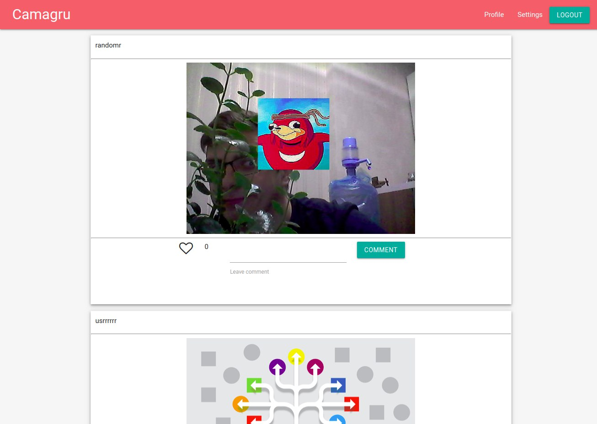

# Camagru

This is  UNIT Factory(42 school) web project.

It includes authorisation with login, sign up, forgot password and email confirming actions.

After login you can make photos with different stickers on it, save it on gallery.

Gallery supports pagination, also you can leave comment or like on every post on it.

# Project setuping

This project is running using docker

## With docker-compose

Just run ``docker-compose up -d --build``

## With docker-machine

- docker-machine create dev --driver virtualbox
 ###### docker-machine -s ${HOME}/goinfre/docker-machines/ create --driver virtualbox dev
- docker-machine env dev
 ###### eval $(docker-machine -s ${HOME}/goinfre/docker-machines/ env machine1)
- eval $(docker-machine env dev)

# Examples

